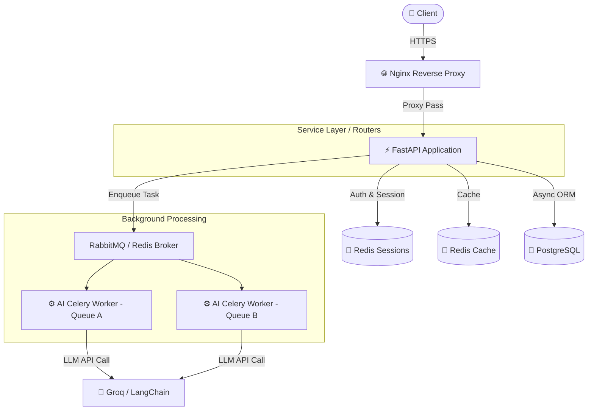
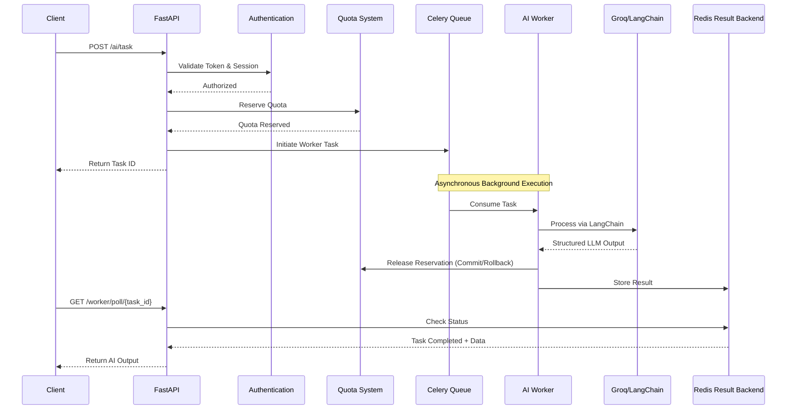

<div align="center">

# 🚀 AI-Powered Blog Backend
**A production-inspired FastAPI backend focused on scalable architecture, AI integration, distributed background processing, and modern backend engineering practices.**

[](https://www.python.org/)
[](https://fastapi.tiangolo.com/)
[](https://www.postgresql.org/)
[](https://www.sqlalchemy.org/)
[](https://redis.io/)
[](https://docs.celeryq.dev/)
[](https://nginx.org/)
[](LICENSE)


</div>

## 📖 About
This project serves as my primary backend engineering portfolio project.

Instead of building another CRUD application, I wanted to understand how production backends are designed and why common architectural patterns exist. Every major component was implemented as a learning exercise, focusing on understanding the trade-offs behind the technology rather than simply using it.

The backend combines asynchronous APIs, distributed task processing, Redis-backed session management, AI services, rate limiting, structured error handling, and clean service-layer architecture into a single production-inspired application.

---

## 📌 Architectural Highlights
- **Thin Route Architecture**
- **Service Layer Pattern**
- **Redis-backed JWT Sessions**
- **Distributed AI Processing**
- **Reservation-Based AI Quotas**
- **Generic Worker Polling**
- **Multiple Celery Queues**
- **Production-Inspired Error Handling**


---

## 🏗 High-Level Architecture



---

## 🧠 AI Processing Flow

```text
POST Request
      │
Authentication
      │
Worker Initiator
      │
Quota Reservation
      │
Celery Queue
      │
AI Worker
      │
Groq / LangChain
      │
Release Reservation
      │
Redis Result Backend
      │
Poll Result Endpoint
```

### 🔄 Sequence Diagram


---

## 🎯 Project Goals
- Build a production-style backend from the ground up
- Learn the purpose behind modern backend architecture
- Keep routes thin and business logic isolated
- Design reusable services instead of feature-specific code
- Build a foundation reusable for future AI applications

---

## ✨ Features

### 🤖 AI Services
- AI Content Rephrasing
- AI Title Generation
- AI Text Summarization
- AI Sentiment Analysis
- Structured LLM Outputs
- Distributed AI Processing using Celery
- Worker Result Polling
- Celery Result Backend

### 🔐 Authentication & Security
- JWT Authentication
- OAuth2 Bearer Tokens
- Password Hashing
- Redis-backed Session Management
- Session Revocation
- Logout From All Devices
- User Ban System
- Protected Endpoints
- Daily AI Usage Quotas
- Reservation-based AI Request Handling

### ⚙ Backend Engineering
- Async FastAPI
- PostgreSQL
- SQLAlchemy Async ORM
- Alembic Migrations
- Dependency Injection
- Service Layer Architecture
- Thin Route Design
- Structured Logging
- Centralized Exception Handling
- Standardized API Responses
- Custom Error Codes
- Generic Worker Result Handling

### ⚡ Infrastructure
- Redis Cache
- Redis Session Storage
- Celery Background Workers
- Multiple Celery Queues
- Async AI Workers
- Retry Logic for Transient Failures
- SlowAPI Rate Limiting
- Nginx Reverse Proxy

---

## 🏛 Design Principles
This project intentionally follows several architectural principles.

- **Keep routes thin:** Separate business logic into services
- **Centralize exception handling**
- **Prefer composition over duplication**
- **Retry only transient failures**
- **Use asynchronous programming where beneficial**
- **Design for maintainability before adding features**
- **Understand every abstraction before introducing it**

---

## 💡 Engineering Decisions
Some design choices were made intentionally to mirror production systems.

- **Redis-backed JWT Sessions:** JWT authentication is combined with Redis session storage, allowing active session tracking, logout from individual devices, logout from all devices, and user banning without waiting for token expiration.
- **Celery Background Workers:** AI requests execute through Celery workers instead of synchronous HTTP requests. This keeps API response times low while allowing long-running AI tasks to execute independently.
- **Reservation-Based AI Quotas:** Quota consumption is reserved before task execution and finalized by the worker. Failed AI requests automatically release the reservation to avoid charging users for unsuccessful operations.
- **Thin Routes:** Routes focus only on request validation and orchestration. Business logic remains inside dedicated service functions and worker initiators.
- **Generic Worker Polling:** All AI services share the same worker result handling mechanism, avoiding duplicated polling logic across endpoints.

---

## 📂 Project Structure
```text
.
├── Ai/
├── celery_worker/
│   ├── celery_app.py
│   └── tasks/
├── core/
├── db_tables/
├── migrations/
├── routers/
│   ├── ai/
│   ├── auth/
│   ├── posts/
│   └── users/
├── utils/
│   ├── logging/
│   ├── schemas.py
│   └── ...
├── main.py
└── requirements.txt
```

---

## 🛠 Tech Stack

| Category | Technologies |
|---|---|
| **Backend** | FastAPI |
| **Language** | Python 3.12 |
| **Database** | PostgreSQL |
| **ORM** | SQLAlchemy Async |
| **Authentication** | JWT, OAuth2 |
| **Cache** | Redis |
| **Background Jobs** | Celery |
| **AI** | LangChain, Groq |
| **AI Monitoring** | LangSmith |
| **Rate Limiting** | SlowAPI |
| **Reverse Proxy** | Nginx |
| **Validation** | Pydantic |
| **Database Migrations** | Alembic |
| **HTTP Client** | HTTPX |

---

## 🚀 Getting Started

1. **Clone the repository**
   ```bash
   git clone https://github.com/Floats-del/blog-ai-service-developing.git
   ```

2. **Create a virtual environment**
   ```bash
   python -m venv .venv
   ```

3. **Activate it**
   - Windows: `.venv\Scriptsctivate`
   - Linux: `source .venv/bin/activate`

4. **Install dependencies**
   ```bash
   pip install -r requirements.txt
   ```

5. **Create a `.env` file**
   ```env
   DATABASE_URL=
   HASH_SECRET_KEY=
   ALGORITHM=
   ACCESS_TOKEN_EXPIRE_MINUTES=
   GROQ_API_KEY=
   LANGSMITH_API_KEY=
   ```

6. **Run database migrations**
   ```bash
   alembic upgrade head
   ```

7. **Start Redis**
   ```bash
   redis-server
   ```

8. **Start Celery Worker**
   ```bash
   celery -A celery_worker.celery_app:celery_app worker --loglevel=info
   ```

9. **Start FastAPI**
   ```bash
   uvicorn main:app --reload
   ```

---

## 📈 What This Project Demonstrates
- Production-inspired backend architecture
- Asynchronous API development
- AI service orchestration
- Distributed task processing
- Session management with Redis
- Clean separation of responsibilities
- Modern authentication patterns
- Scalable backend design

---

## 🗺 Roadmap

### ✅ Completed
- [x] Async FastAPI
- [x] PostgreSQL Integration
- [x] SQLAlchemy Async ORM
- [x] JWT Authentication
- [x] Redis Integration
- [x] Redis Session Management
- [x] Session Revocation
- [x] AI Services
- [x] Structured Logging
- [x] Rate Limiting
- [x] Celery Background Workers
- [x] Multiple Celery Queues
- [x] Nginx Reverse Proxy

### ⏳ Future Improvements
- [ ] Docker
- [ ] CI/CD
- [ ] Kubernetes
- [ ] WebSockets
- [ ] OpenTelemetry
- [ ] Google OAuth
- [ ] Password Reset
- [ ] Role-Based Access Control
- [ ] Billing System
- [ ] Blue-Green Deployment

---

## 📚 Lessons Learned
This project taught me significantly more than simply using frameworks. Some of the most valuable concepts explored include:

- Why JWT alone is often insufficient without server-side session management.
- When background workers are preferable to synchronous request processing.
- How asynchronous programming changes backend architecture.
- Why service layers improve maintainability.
- How distributed systems require retry strategies and reservation handling.
- Why architectural simplicity is often better than unnecessary abstraction.

---

## 📜 License
This project is licensed under the MIT License. See the `LICENSE` file for more information.
